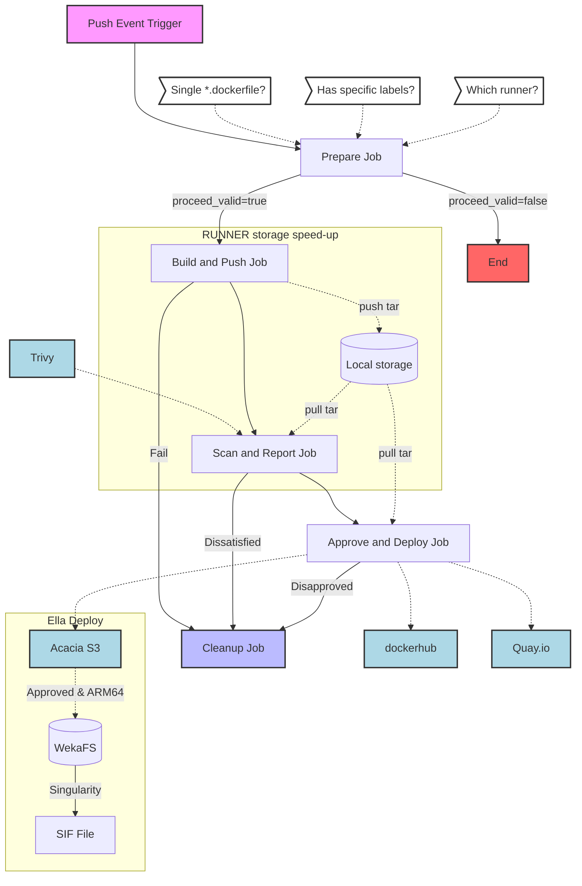
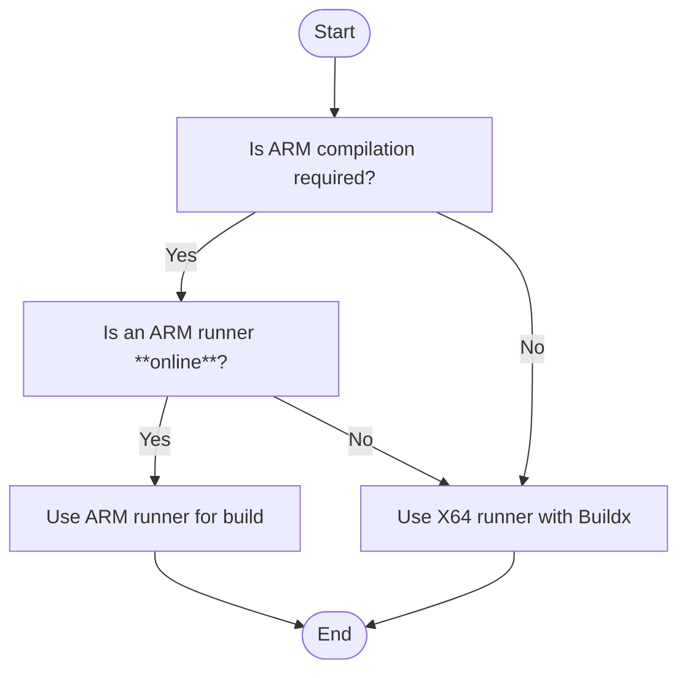

# README for docker-ci.yml

This GitHub Actions workflow automates the building, scanning, and deployment of Docker images based on changes to Dockerfiles in the repository. It supports cross-platform builds (for Setonix and Ella), utilizes caching mechanisms to optimize build times, and incorporates security scanning to ensure image integrity. 

This document provides a detailed explanation of the workflow, including trigger logic, variable and secret configurations, and the internal logic of each step.

## Table of Contents

- [Trigger Logic](#trigger-logic)
- [Runner Logic](#runner-logic)
- [Prerequisites](#prerequisites)
- [Variables and Secrets Configuration](#variables-and-secrets-configuration)
- [Workflow Overview](#workflow-overview)
  - [PREPARE-job](#prepare-job)
  - [BUILD-AND-PUSH-job](#build-and-push-job)
  - [SCAN-AND-REPORT-job](#scan-and-report-job)
  - [APPROVE-AND-PUSH-job](#approve-and-deploy-job)
  - [CLEANUP-job](#cleanup-job)
  - [Deploy-job](#deploy-job) 
- [Cache Logic](#cache-logic)
- [Cross-Platform Logic](#cross-platform-logic)
- [Conclusion](#conclusion)

## Trigger Logic

The workflow is triggered on every `push` event to the repository. However, it only proceeds under the following conditions:

- **Single Dockerfile Modification**: Exactly **ONLY** one Dockerfile can be modified in the commit.
- **Specific Label Present**: 
    - The modified Dockerfile must contain the label `org.opencontainers.image.compilation=auto`.
    - The modified Docerfile must contain the laber for arch `LABEL org.opencontainers.image.arch=x86` or `LABEL org.opencontainers.image.arch=arm`

If these conditions are not met, the workflow exits gracefully without performing any further actions. This ensures that builds are only triggered for intentional and specific changes.

## Runner logic
**Which instance will be used for compilation for execution?**

The "Determine Runner Label" step selects the appropriate runner for building the project based on the required architecture and runner availability. 
- If an **ARM compilation is required** (`LABEL org.opencontainers.image.arch=arm`) and an **ARM-architecure runner is online**, it uses the ARM runner for the build. 
- Otherwise, it defaults to using the `X64` architecture with `Buildx`(`X64` or `ARM`). 
- We didn't use the instance guarded methoed, i.e., upto only one `ARM` label runner and only one `X64` can be kept running online simultaneously.

## Prerequisites (if forked)
- **Uplift your current account to sudo group (admin group for Mac)** : As this script use local storage (save image to local path) which beyonds the Github workspace scope, you need to upgrade `$(whoami)` to sudo group and also set no PASSWORD are required for this group.
- **Docker Hub Account**: Required for pushing Docker images to Docker Hub.
- **Quay.io Account**: An alternative container registry for hosting Docker images.
- **Access to S3-Compatible Storage**: For uploading Docker image archives to Acacia (Pawsey) using `rclone`.
- **Self-Hosted Runner**: The workflow specifies `runs-on: experiment`, indicating the use of a self-hosted runner named `work` (You can use your other BYO runner).
- **PAT Token**: PAT token is used for checking the runner label and their availability. 
## Variables and Secrets Configuration

The workflow requires certain variables and secrets to be set in your repository settings:

### Variables (`vars`)
To configure the required variables, navigate to your repository's Settings > Secrets and variables > Actions > Variables, then add each variable (e.g., DOCKERHUB_USERNAME, QUAYIO_USERNAME) with their corresponding values.

- `DOCKERHUB_USERNAME`: Your Docker Hub username.
- `QUAYIO_USERNAME`: Your Quay.io username.
- `ACACIA_BUCKETNAME`: Your targeted acacia bucketname.

### Secrets (`secrets`)
To configure the required variables, navigate to your repository's Settings > Secrets and variables > Actions > Variables, then add each variable (e.g., ACACIA_ACCESS_KEY_ID, ACACIA_SECRET_ACCESS_KEY, DOCKERHUB_TOKEN, QUAYIO_TOKEN) with their corresponding values.
- `DOCKERHUB_TOKEN`: A Docker Hub access token with permissions to push images.
- `QUAYIO_TOKEN`: A Quay.io access token with permissions to push images.
- `ACACIA_ACCESS_KEY_ID`: Access key ID for the S3-compatible storage.
- `ACACIA_SECRET_ACCESS_KEY`: Secret access key for the S3-compatible storage.
- `PAT_TOKEN`: PAT token is used for checking the runner label and their availability. 

These variables and secrets are used throughout the workflow for authentication and tagging purposes.

### Environments (`manual_approval`)
The manual_approval environment is configured to require explicit manual approval before the deployment process proceeds. This ensures that all deployments are reviewed and authorized by designated team members, adding an additional layer of security and control to the CI pipeline.

Navigate to your repository's Settings > Environments > New Environment > Name (`manual_approval`), then under Deployment protection rules, click (`Require reviewers`) and Save protection rules.
## Workflow Overview

The workflow consists of several jobs that execute sequentially or in parallel, depending on their dependencies.

### PREPARE-job

This initial job sets up the environment and determines whether the workflow should proceed based on the trigger logic.

**Key Steps:**

1. **Checkout Repository**: Uses `actions/checkout@v4` to fetch the latest code with a `fetch-depth` of 2 to ensure sufficient commit history for comparison.

2. **Get Changed Files**: 
   - Uses `git diff` to identify Dockerfiles (`*.dockerfile`) that have changed between the previous commit and the current one.
   - Stores the list of changed files in the `files` output variable.

3. **Set Proceed Flag**: 
   - Checks if no Dockerfiles or multiple Dockerfiles have been modified.
     - If no Dockerfiles are modified, sets `proceed_valid` to `false` and exits.
     - If multiple Dockerfiles are modified, sets `proceed_valid` to `false` and exits.
   - If exactly one Dockerfile is modified, proceeds to check for the required label.
   - Verifies that the Dockerfile contains `LABEL org.opencontainers.image.compilation=auto`.
     - If present, sets `proceed_valid` to `true`.
     - If not, sets `proceed_valid` to `false` and exits.

4. **Parse File Path**: Extracts necessary information from the modified Dockerfile:
   - `directory`: The directory containing the Dockerfile.
   - `dockerfile_name`: The base name of the Dockerfile without the extension.
   - `platform` and `platform_tag`: Determined by checking the `org.opencontainers.image.arch` label in the Dockerfile.
     - Supports `linux/arm64` (tagged as `arm`) and `linux/amd64` (tagged as `x86`).

5. **Set Current Date**: Captures the current date in `MM-DD` format for use in tagging the Docker image.

6. **Debug Variables**: Outputs the collected variables for verification purposes.

### BUILD-AND-PUSH-job

This job builds the Docker image using Docker Buildx and saves it for later use.

**Key Steps:**

1. **Set Up QEMU**: Uses `docker/setup-qemu-action@v3` to enable cross-platform emulation, allowing builds for different architectures.

2. **Set Up Docker Buildx**: Initializes Docker Buildx with the `docker-container` driver.

3. **Enable BuildKit**: Activates Docker BuildKit by setting `DOCKER_BUILDKIT=1` in the environment, enhancing build performance.

4. **Build Docker Image**:
   - Uses `docker/build-push-action@v6` to build the Docker image.
   - Context and Dockerfile path are set based on the modified Dockerfile.
   - Image is tagged using the format: `{dockerfile_name}-{platform_tag}:{date}`.
   - Specifies the target platform (`linux/arm64` or `linux/amd64`).
   - Uses caching mechanisms:
     - `cache-from: type=gha` to pull cache from GitHub Actions cache.
     - `cache-to: type=gha,mode=max` to save build cache layers.

5. **Save Docker Image**:
   - Saves the built Docker image to `image.tar`.
   - Moves `image.tar` to a persistent storage directory: `$HOME/runner/artifacts/{dockerfile_name}-{platform_tag}/image.tar`.

### SCAN-AND-REPORT-job

This job scans the Docker image for vulnerabilities using Trivy and generates a report.

**Key Steps:**

1. **Retrieve Docker Image**: Copies `image.tar` from the persistent storage back to the workspace.

2. **Create Report Directory**: Ensures that the `trivy-reports` directory exists.

3. **Scan with Trivy**:
   - Uses `aquasecurity/trivy-action@master` to scan the Docker image.
   - Focuses on `CRITICAL` and `HIGH` severity vulnerabilities.
   - Outputs the scan report in `table` format to `./trivy-reports/trivy-report-{dockerfile_name}.txt`.
   - Ignores unfixed vulnerabilities to focus on actionable items.

4. **Add Report to Summary**: Appends the Trivy scan report to the GitHub Actions summary for easy viewing.

5. **Upload Trivy Report**: Uploads the report as an artifact named `trivy-report-{dockerfile_name}`.

### APPROVE-AND-DEPLOY-job

This job requires manual approval before proceeding, adding an extra layer of control. It handles the deployment of the Docker image to registries and storage.

**Key Steps:**

1. **Environment Configuration**: 
   - Sets `BUCKET` and `DESTINATION_PATH` for uploading to S3-compatible storage.
   - The `environment` field is set to `manual_approval`, enabling manual intervention if required.

2. **Login to Registries**:
   - Logs into Docker Hub using `docker/login-action@v3` with the provided username and token.
   - Logs into Quay.io using `docker/login-action@v3` with the provided username and token.

3. **Load and Tag Docker Image**:
   - Loads the Docker image from `image.tar`.
   - Tags the image for Docker Hub and Quay.io using the format:
     - Docker Hub: `{DOCKERHUB_USERNAME}/{dockerfile_name}-{platform_tag}:{date}`
     - Quay.io: `quay.io/{QUAYIO_USERNAME}/{dockerfile_name}-{platform_tag}:{date}`

4. **Push Docker Image**:
   - Pushes the tagged image to Docker Hub.
   - Pushes the tagged image to Quay.io.

5. **Upload to S3-Compatible Storage**:
   - Sets up `rclone` using the custom action `./.github/actions/setup-rclone` with the provided S3 credentials.
   - Uploads `image.tar` to the specified bucket and destination path.

### CLEANUP-job

This job runs regardless of the previous job outcomes (`if: always()`) to ensure that temporary files and artifacts are cleaned up.

**Key Steps:**

1. **Clean Up Artifacts**: Removes the persistent storage directory (`$HOME/runner/artifacts/{dockerfile_name}-{platform_tag}`) containing the Docker image tar file.

## Cache Logic

The workflow employs caching strategies to optimize build times:

- **GitHub Actions Cache**: Uses the GitHub Actions cache service to store and retrieve Docker build cache layers.
- **Cache Configuration in Build**:
  - `cache-from: type=gha`: Pulls cache layers from previous builds stored in GitHub Actions cache.
  - `cache-to: type=gha,mode=max`: Saves the cache layers back to GitHub Actions cache with maximum retention.
- **Benefits**:
  - Reduces build times by reusing previously built layers.
  - Minimizes network bandwidth and storage usage.

## Cross-Platform Logic

Supporting multiple architectures is achieved through:

- **Architecture Detection**:
  - The workflow reads the `org.opencontainers.image.arch` label in the Dockerfile.
  - Supports the following architectures:
    - `arm`, `aarch64`, `arm64`: Mapped to `linux/arm64`.
    - `x86`, `amd64`, `x86_64`: Mapped to `linux/amd64`.
  - If the architecture label is missing or unrecognized, the workflow exits with an error.

- **QEMU Emulation**:
  - QEMU is set up to enable emulation of different CPU architectures, allowing builds for platforms other than the host machine.

- **Docker Buildx**:
  - Buildx is configured to use the `docker-container` driver, which supports multi-platform builds.
  - The `platforms` option specifies the target architecture for the build.

- **Platform Tags**:
  - Images are tagged with platform-specific identifiers (`arm` or `x86`) to distinguish between different builds.

## Conclusion

This comprehensive workflow automates the building, scanning, and deployment of Docker images in a secure and efficient manner. By incorporating caching mechanisms and cross-platform capabilities, it ensures that images are built quickly and are compatible with various architectures. The inclusion of a vulnerability scanning step enhances security, while the manual approval process before deployment adds an extra layer of control. This workflow is a robust solution for continuous integration and deployment pipelines involving Docker images.

## License
This project is licensed under the MIT License.

## Contact and Author
For any questions or support, please open an issue in the repository or contact Shusen Liu (Shusen.liu@pawsey.org.au or shusen.liu@csiro.au)